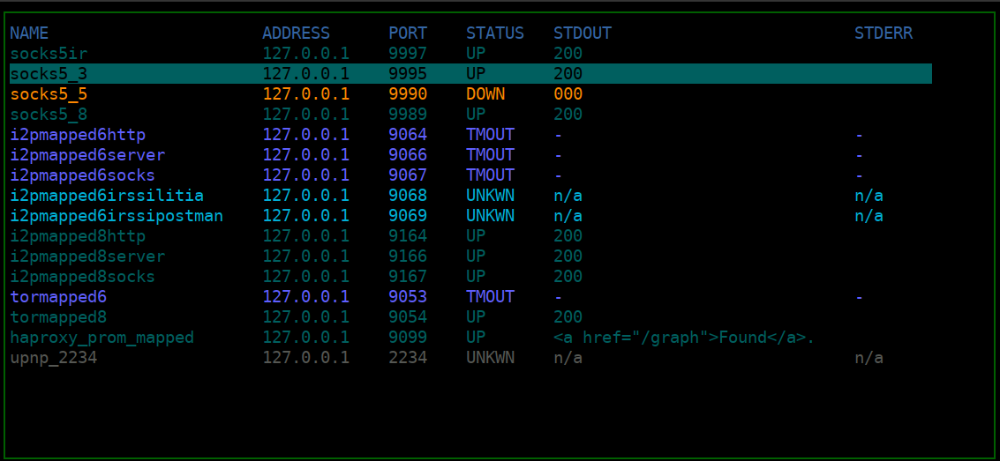

# tunneltop
A tunnel manager in the familiar top style written with ncurses and asyncio.



## Install
```sh
pip install tunneltop
```

## what it is
* a simple tunnel manager written in python that uses the standard library only(standard library only in python 3.11)
* it starts and manages the tunnels for you
* lets the user interactively manage the tunnels as well
* will reload the config file if it receives a `SIGHUP`
* it is intentionally written as simple and tunnel-agnostic
* may or may not work on windows(let me know if you test it on windows)

## toml file

tunneltop expects its config file to be at at `$HOME/.tunneltoprc`.

You can see an example config file below:</br>
```toml
[color]
header_fg = 4
header_bg = 0
active_fg = 23
active_bg = 0
disabled_fg = 8
disabled_bg = 0
timeout_fg = 63
timeout_bg = 0
unknown_fg = 38
unknown_bg = 0
down_fg = 208
down_bg = 0
box_fg = 22
box_bg = 0

[tunnel.socks5ir]
address = "127.0.0.1"
port = 9997
command = "autossh -M 0 -N -D 9997 -o ServerAliveInterval=180 -o ServerAliveCountMax=3 -o ExitOnForwardFailure=yes -l debian -p 22 100.100.100.101"
test_command = 'curl -s -o /dev/null -s -w "%{http_code}" -k -I -4 --socks5 socks5h://127.0.0.1:9997 https://icanhazip.com'
test_command_result = "200"
test_interval = 300
test_timeout = 10

[tunnel.socks5_3]
address = "127.0.0.1"
port = 9995
command = "autossh -M 0 -N -D 0.0.0.0:9995 -o StrictHostKeyChecking=no -o UserKnownHostsFile=/dev/null -o VerifyHostKeyDNS=no -o ServerAliveInterval=180 -o ServerAliveCountMax=3 -o ExitOnForwardFailure=yes -l debian -p 2022 100.100.100.100"
test_command = 'curl -s -o /dev/null -s -w "%{http_code}" -k -I -4 --socks5 socks5h://127.0.0.1:9995 https://icanhazip.com'
test_command_result = "200"
test_interval = 300
test_timeout = 10
```

The tunnel names must be unique.</br>

### address
Displays the address at which the tunnel is available at. It is a display-only option.</br>

### port
Displays the port at which the tunnel is available at. It is a display-only option.</br>

### command
The command used to start the tunnel.</br>

### test_command
The command used to test the state of the tunnel.</br>

### test_command_result
The expected result of the test command.</br>

### test_interval
How often should the `test_command` be run.</br>

### test_timeout
How long before the test is considered to have timed out.</br>

## keybindings
`j` and `k` move you up and down.</br>

`g` and `G`move you to the first or last tunnel.</br>

`s` toggles a tunnel from enabled to disabled or vice versa.</br>

`r`  restarts a tunnel.</br>

`t` runs the test right now.</br>

To quit send a `SIGINT` or a `SIGTERM`. I'm working on improving this of course.</br>

tunneltop will reload its config file upon receiving a `SIGHUP` and apply the changes immediately if there are any.</br>
